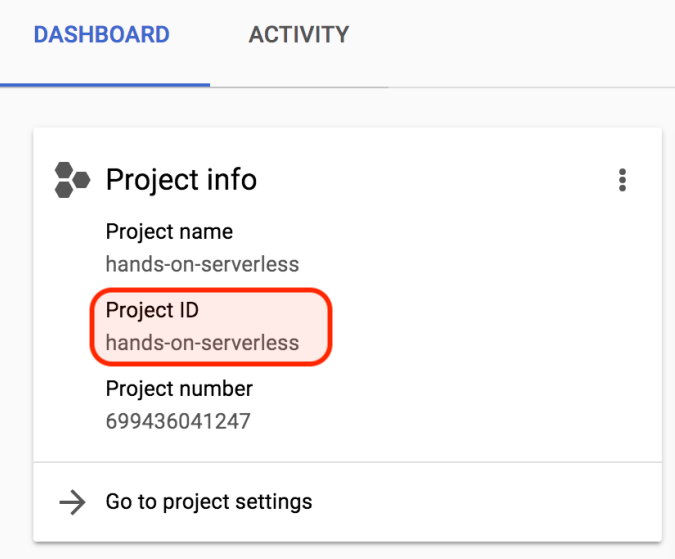
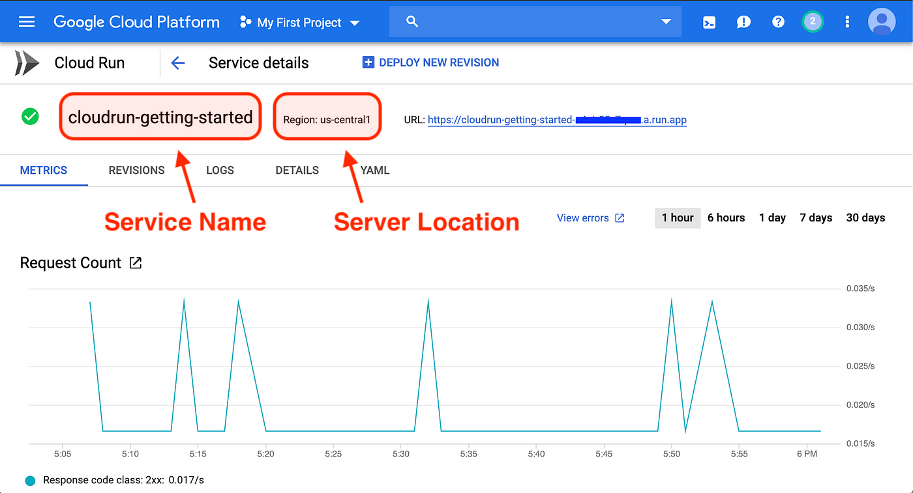
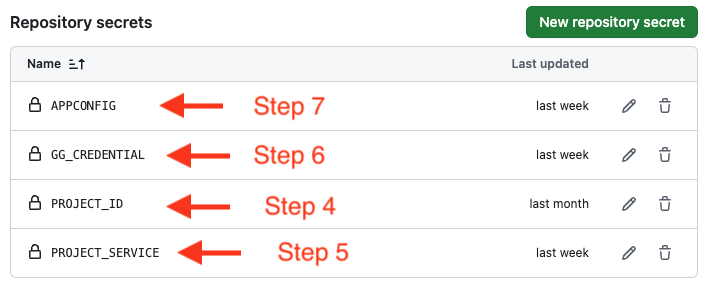

# ILUVUS - BACKEND API

<p align="center">

</p>

### Description

We're working on a social media app called ILUVUS, which focuses on celebrating racial minorities and marginalized communities like the LGBTQ+. Our goal is to connect these diverse communities in a world where discrimination and intolerance are still prevalent. ILUVUS aims to address this issue by promoting positivity, celebrating achievements, and combatting discrimination.

We're developing our own platform instead of using existing ones because they don't prioritize the celebration and recognition of these communities' accomplishments. Our focus is on offering a unique user experience that celebrates diversity. By doing this, we can ensure strict moderation of hateful posts and messages and promote positivity effectively.

## Getting Started

### Technology Stack:

-   **Spring Boot**: A Java-based framework for building robust and scalable backend applications.

-   **Google Cloud Platform (GCP)**: Google Cloud Run for deploying and running containerized applications.

-   **Google Cloud Storage**: A scalable and secure object storage solution provided by Google Cloud Platform.

-   **GitHub Actions**: GitHub's built-in CI/CD solution for automating workflows, including building, testing, and deploying applications.

### Dependencies

-   Maven

-   Generally, use the following [link](https://www.baeldung.com/install-maven-on-windows-linux-mac) to install maven on your system.

-   For Mac OS: [Instruction](https://help.mulesoft.com/s/article/How-to-Setup-Maven-for-Mac-OS)

-   For Windows: [Instruction](https://mkyong.com/maven/how-to-install-maven-in-windows/)

-   JDK 8+

-   Use this link [https://adoptium.net/temurin/releases/](https://adoptium.net/temurin/releases/) to download and install OpenJDK version that is compatible with your Operation System.

### Installing & Execute

1. Use the following link to install maven on your system.

[https://www.baeldung.com/install-maven-on-windows-linux-mac](https://www.baeldung.com/install-maven-on-windows-linux-mac)

-   For Mac OS: [Instruction](https://help.mulesoft.com/s/article/How-to-Setup-Maven-for-Mac-OS)

-   For Windows: [Instruction](https://mkyong.com/maven/how-to-install-maven-in-windows/)

2. Clone the ILUVUS Backend API Repository:

```bash

git clone https://github.com/ILUVUS/iluvus-backend-api-JIA-3317.git

```

3. Create `application.properties` in `/src/main/resources`. Modify the following content:

```java
spring.data.mongodb.uri=mongodb+srv://<USERNAME:<PASSWORD>@iluvusdb.mocs11o.mongodb.net/iluvus
spring.data.mongodb.database=iluvus
iluvus.email.passwordtoken=<GMAIL_GENERATED_PASSWORD>
```

Modify `<USERNAME>` and `<PASSWORD>` with provided information.

4. Go to the repository directory on your Operation System. Run SpringBoot:

```bash

mvn spring-boot:run

```

4. Check the API with your browser: [127.0.0.1/8080](127.0.0.1/8080)

5. Your browser should return: `Welcome to ILUVUS. API is running well!`

### Deployment on Google Cloud

1. [Create a new Google Cloud Project](https://developers.google.com/workspace/guides/create-project)

2. [Create an Artifact Registry Repository](https://cloud.google.com/artifact-registry/docs/repositories/create-repos)

    - Name the Repo "iluvus", all lowercase
    - Make sure the repo is created under the same service account

3. [Create a Cloud Run Service](https://cloud.google.com/run/docs/deploying)

    - Make sure the service is created under the same service account

4. Locate to GCP Dashboard, use this to replace the `PROJECT_ID` on Github Secrets.

 

5. Locate to GCP Cloud Run Dashboard, copy the Service Name and use this to replace `PROJECT_SERVICE` on Github Secrets.



6. [Create a Google Service Account Credential](https://developers.google.com/workspace/guides/create-credentials#create_credentials_for_a_service_account)

    - Copy the content of the JSON file obtained from the step 5 above. Use the content to replace the `GG_CREDENTIAL` on Github Secrets.

7. Create APPCONFIG

Modify the following content:

```java
spring.data.mongodb.uri=mongodb+srv://<USERNAME:<PASSWORD>@iluvusdb.mocs11o.mongodb.net/iluvus
spring.data.mongodb.database=iluvus
iluvus.email.passwordtoken=<GMAIL_GENERATED_PASSWORD>
```

Modify `<USERNAME>` and `<PASSWORD>` with provided information.

8. Use the APPCONFIG Content to replace the APPCONFIG on Github Secrets.

After all, the Github Secrets should map with the above steps like below:



# Release Notes

## Version 0.5.0

### New Features

-   Community Users can view videos in Media Viewer.
-   Community Users can create new post with videos.
-   Professional Users can view their Created Groups in its own view.
-   All Users can view their Following Groups in its own view.
-   Users can view their birthday on Profile page.
-   Live error indicators in Registration Form.
-   Communities are removed if a user account is removed from ILUVUS.

### Bug Fixes

-   Users could not get the relevant post properly on Home Screen after re-selecting interests.
-   User could not post Text only post.
-   Professional Users could not receive verification code.
-   Users must be 18 or older to sign up an account.
-   Community View buttons were flickery.
-   Reported post automatically removed once there is more than 5 reports.

### Known Issues

-   Login Form Scrollview does not scroll down properly.
-   Status bar text blends with background color.

## Version 0.4.0

### New Features

-   Users can receive notifications for uplifts, comments, tags, reports, and other types from communities.
-   Users can view the posts that are relevant to their interests in the newsfeed.
-   Users can select the interest topic when creating posts.
-   Added the profile page to display user information.
-   Users can select and edit their interests on the profile page.
-   Added users as moderators at the creating community view to manage reporting posts (keep or remove from the community).
-   Moderator users can view and accept or reject reporting posts.
-   Community owner can set profile pictures for their community at the creating point.

### Bug Fixes

-   Fixed the problem where notifications disappear.
-   Fixed the image display on the posts in the communities.
-   Change to switch button when asking for the professional or regular user at the registration screen.
-   The community list is displayed in order.

### Known Issues

-   The algorithm to sort the posts by interests sometimes goes wrong.
-   The post page is frozen if no images are selected.

## Version 0.3.0

### New Features

-   Users can now upload and share images along with their posts.
-   Users can view/zoom images in a post.
-   Implemented image processing capabilities such as resizing and compression.
-   Ability to tag other users in a post has been added.
-   Communities can now be set as either public or private.
-   Added a "Request Join" button for private communities.
-   Owners of private communities can now accept/decline join requests.
-   All login passwords are now hashed to increase security.
-

### Bug Fixes

-   Corrected the display of the number of likes/uplifts.
-   Fixed the problem where posts were not displaying properly.
-   Fixed the report button and added a report message when reporting.

### Known Issues

-   Users can tag people not in the community.

## Version 0.2.0

### New Features

-   Create text-only posts and display them on the community posts.
-   Like and dislike a post in a community.
-   Comment on a post in a community.
-   Report a post in a community.
-   Display the number of uplift(like) on the community posts.
-   Display the comment view on the community posts.

### Bug Fix

### Known Issues

-   Registration will navigate to verification screen even the user existed.
-   Verification page may send 2 emails.

## Version 0.1.0

### Features

-   Search community by the community’s name
-   View, and join community
-   Register inputs indicator
-   Date picker for Date of Birth input on Register screen

### Bug Fixes

-   Register new user with empty username and password
-   Create new community button did not show up
-   Verify does not work with userId

### Known Issues

## License

This project is licensed under the MIT License.

## Contributors:

-   [Arjun Ramani](#)
-   [Binaya Timsina](#)
-   [Doan Tran](#)
-   [Thuan Vo](#)
-   [Tyler Lin](#)

## Acknowledgments

Ideas, Inspiration, and Project belong to [James Elliott](#)
